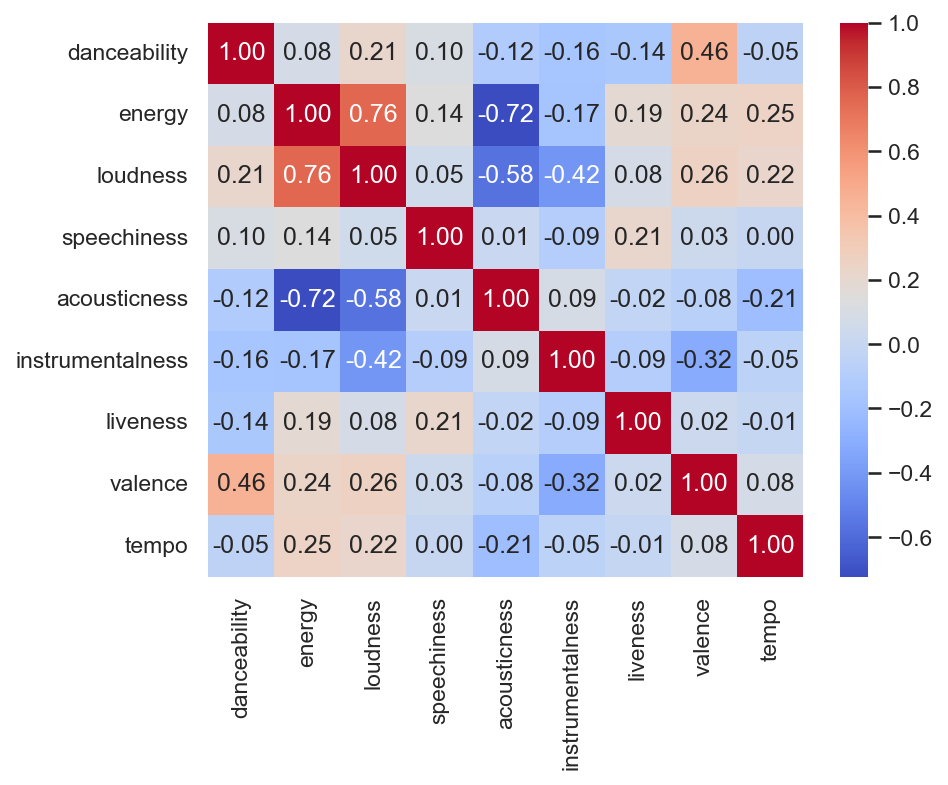
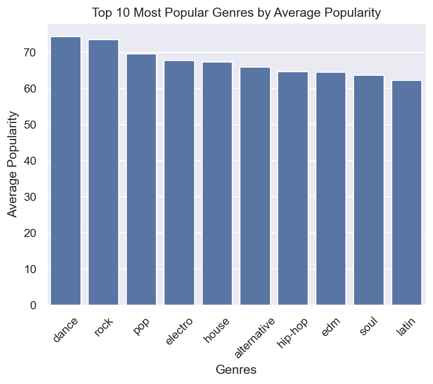

# spotify-eda-recommender
EDA and content-based song recommender using Spotify tracks dataset

# 🎵 Spotify EDA & Song Recommender

Exploratory data analysis and content-based song recommender built on a 114k Spotify tracks dataset.

## Objective
Explore what makes a song popular on Spotify and build a recommender system that suggests similar tracks based on audio features.

## Dataset
[Spotify Tracks Dataset](https://www.kaggle.com/datasets/maharshipandya/-spotify-tracks-dataset/data) — 114k tracks with audio features such as danceability, energy, loudness, acousticness, and more.

## Key Findings
- **Dance and Rock dominate popularity rankings** across all genres in the dataset.
- **No single audio feature predicts popularity** — danceability, energy and valence show similar distributions across all popularity ranges.
- **Energy and Loudness are strongly correlated (0.76)** — louder songs tend to be more energetic.




## Project Structure
```
├── data/
│   ├── raw/           # Original dataset
│   └── processed/     # Cleaned dataset
├── notebooks/
│   ├── 01_eda.ipynb          # Exploratory Data Analysis
│   └── 02_recommender.ipynb  # Song Recommender
├── images/            # Saved visualizations
└── requirements.txt
```

## How to Run
```bash
git clone https://github.com/Flakkito/spotify-eda-recommender.git
cd spotify-eda-recommender
python -m venv venv
venv\Scripts\activate
pip install -r requirements.txt
```
Then open the notebooks in VS Code and run all cells.

## Tech Stack
- Python, Pandas, NumPy
- Matplotlib, Seaborn
- Scikit-learn (MinMaxScaler, Cosine Similarity)